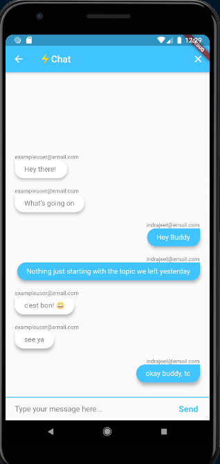
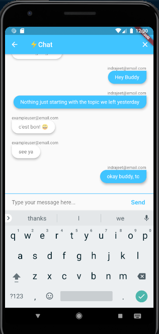

# Instant Chat ⚡️
A simple group chat application, in which user can register or login and join the group chat.
 
Learned from a course by  <a href="https://github.com/angelabauer"> Angela Yu</a>. Thanks to her.  
 

<h2> Screenshots-</h2> 

## Things i learned while making this App-
 - Working with Routes
 - Working with Hero Animation
 - Working with Custom animation using ticker and animation controller.
 - Working with CurvedAnimation, ColorTween 
 - Working with different keyboards while inputting text inside textfields
 - Working with ModalProgressHUD
 - Listening to data changes using snapshots from firebase
 - Working with StreamBuilders
 - Working with Expanded Widget
 - Working with username,password authentication using Google authentication
 - working with firestore 